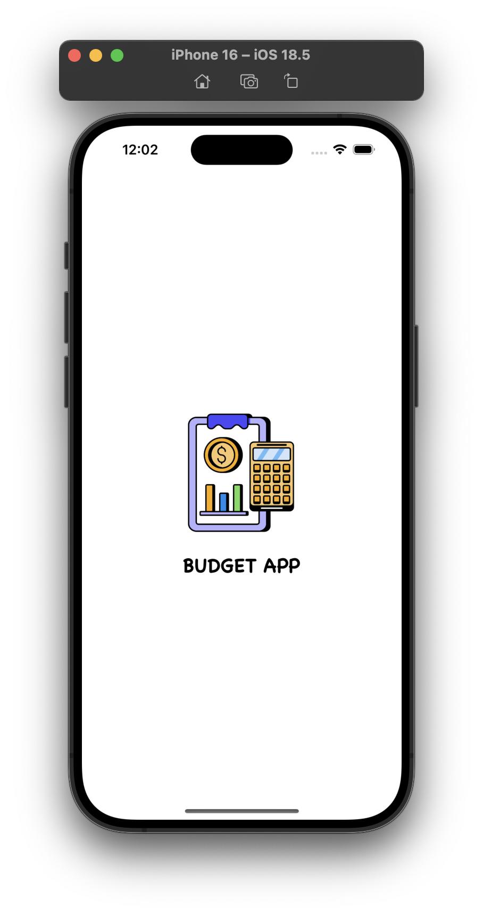
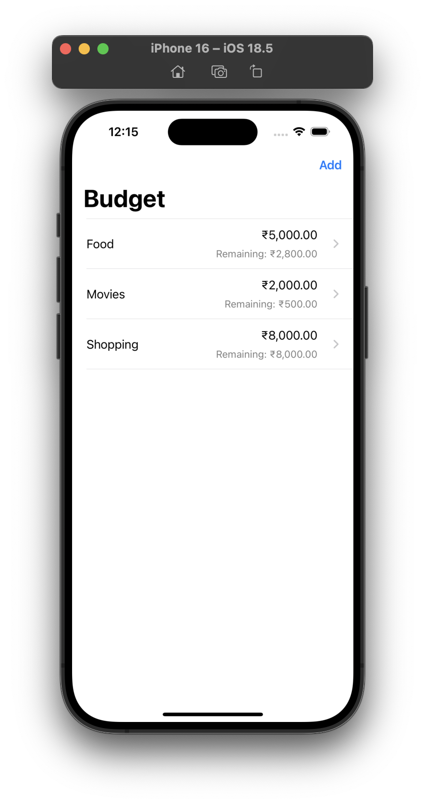
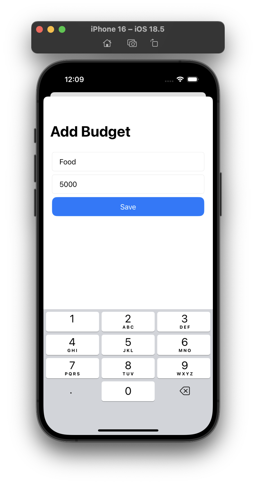
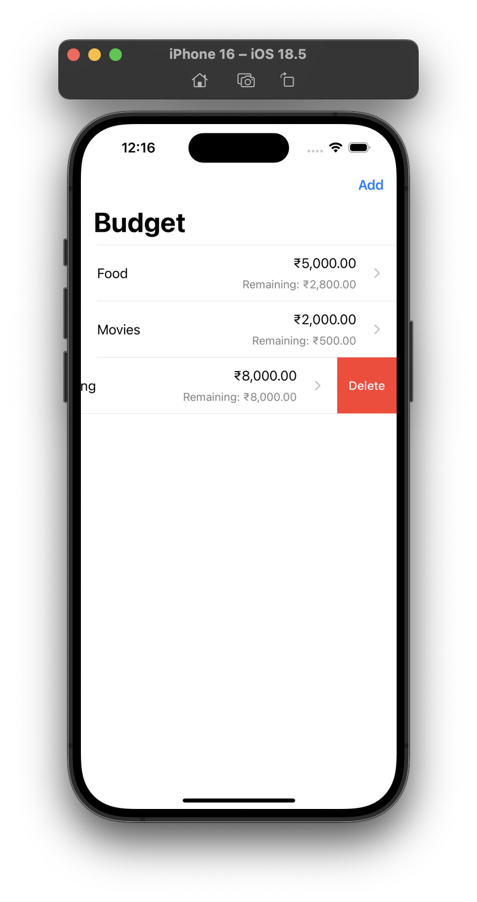
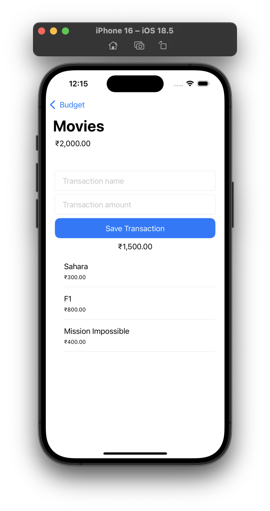
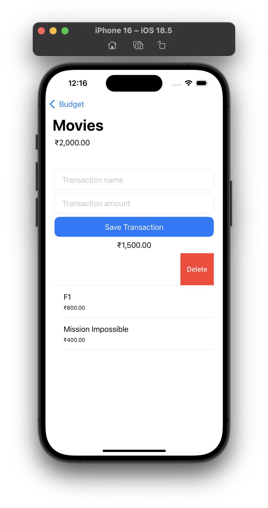

# 💰 BudgetApp

An iOS app built with **UIKit** and **Core Data**, BudgetApp helps you create categories, manage transactions, and keep track of your spending with a clean and simple interface.

---

## 🚀 Features

* 📂 **Category Management** – Add, view, and delete budget categories.
* 💸 **Transaction Tracking** – Add and delete transactions for each category.
* 🗂️ **Persistent Storage** – Powered by **Core Data** to save data locally.
* 🔄 **Live Updates** – `NSFetchedResultsController` keeps lists in sync automatically.
* 🖼️ **Custom UI** – Professional `UITableViewCell` layouts with spacing and padding.
* 📱 **Adaptive Layouts** – Designed to work on different iPhone sizes.
* ⚡ **Clean Architecture** – Organized using **MVC pattern**.

---

## 🧰 Tech Stack

* 🧑‍💻 Language: **Swift**
* 🖼️ UI Framework: **UIKit**
* 📦 Persistence: **Core Data**
* 🗄️ Architecture: **MVC**
* 💻 IDE: **Xcode**
* 🚀 Deployment Target: **iOS 15+**

---

## 📸 Screenshots

<div style="display: flex; flex-wrap: wrap; gap: 10px;">
  
  
</div>

<div style="display: flex; flex-wrap: wrap; gap: 10px;">
  
  
</div>

<div style="display: flex; flex-wrap: wrap; gap: 10px;">
  
  
</div>

---

## 📁 Project Structure

```bash
├── BudgetApp.xcodeproj
│   └── project.pbxproj
├── project.xcworkspace
│   └── contents.xcworkspacedata
├── xcuserdata
│   └── sameer.xcuserdatad
│       └── xcschemes
│           └── xcschememanagement.plist
│
├── BudgetApp
│   ├── App
│   │   ├── AppDelegate.swift
│   │   └── SceneDelegate.swift
│   │
│   ├── Core
│   │   ├── Controllers
│   │   │   ├── AddBudgetCategoryViewController.swift
│   │   │   ├── BudgetCategoriesTableViewController.swift
│   │   │   └── BudgetDetailsViewController.swift
│   │   │
│   │   ├── UIComponents
│   │   │   ├── Cells
│   │   │   │   └── BudgetCategoryTableViewCell.swift
│   │   │   ├── LabelView.swift
│   │   │   ├── PrimaryButton.swift
│   │   │   ├── StackView.swift
│   │   │   └── TextFieldView.swift
│   │   │
│   │   ├── Utilities
│   │   │   ├── FormValidator.swift
│   │   │   └── showAlert.swift
│   │   │
│   │   └── Views
│   │       ├── AddBudgetCategoryView.swift
│   │       └── BudgetDetailView.swift
│   │
│   ├── Extensions
│   │   ├── Double.swift
│   │   ├── NSSet.swift
│   │   └── String.swift
│   │
│   ├── Models
│   │   └── BudgetCategory.swift
│   │
│   └── Resources
│       ├── Assets.xcassets
│       │
│       ├── Base.lproj
│       │   └── LaunchScreen.storyboard
│       │
│       ├── BudgetModel.xcdatamodeld
│       │   └── BudgetModel.xcdatamodel
│       │       └── contents
│       │
│       └── Info.plist
│
└── README.md
```

---

## 🚀 Getting Started

### Prerequisites

* Xcode (latest stable version)
* iOS SDK (iOS 15+)

### Installation

Clone the repository:

```bash
git clone https://github.com/SameerNadaf/Budget-Application.git
cd BudgetApp
```

Open in Xcode:

```bash
open BudgetApp.xcodeproj
```

Run the app:

* Select your simulator or device.
* Press **Cmd + R**.

---

## 📖 Usage

* **Categories List** → Browse all your budget categories.
* **Add Category** → Create a new budget category with name & amount.
* **Transactions** → Track spending inside each category.
* **Add Transaction** → Add or remove transactions for better control.
* **Delete Support** → Swipe-to-delete categories or transactions.

---

## 🤝 Contributing

Contributions are welcome!

1. Fork the repo.
2. Create a branch (`git checkout -b feature/YourFeature`).
3. Commit changes (`git commit -m "Add YourFeature"`).
4. Push (`git push origin feature/YourFeature`).
5. Open a Pull Request.

---

## 📜 License

MIT License

---

## 👨‍💻 Contact

Developed by **Sameer Nadaf**
⭐ Drop a star on [GitHub](https://github.com/SameerNadaf) if you find this project useful!
